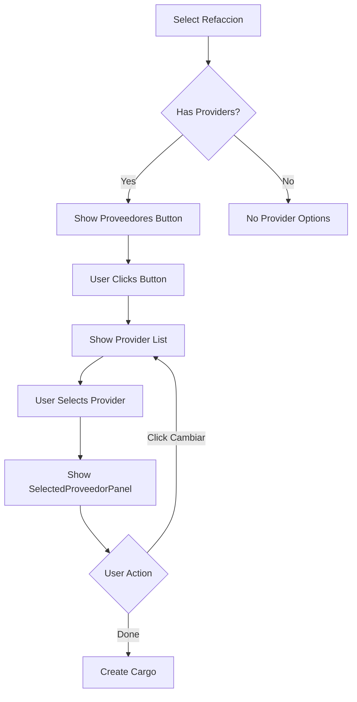
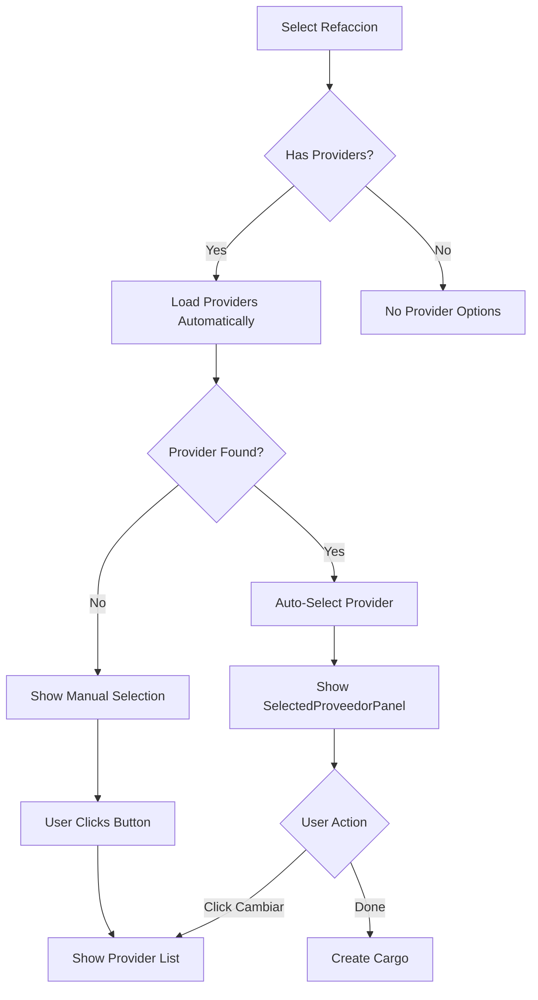

# 🎨 Visual Summary: Provider Display and Preselection

## 📋 Overview

This document provides a visual representation of the new provider selection display and preselection features added to `SeleccionarRefaccionUserControl`.

## 🔄 Feature 1: Display Selected Provider

### Problem
Previously, when a user selected a provider from the list, the provider list remained visible and there was no clear indication of the selected provider similar to how the selected refaccion is displayed.

### Solution
Added a `SelectedProveedorPanel` that displays the selected provider in a collapsed view, matching the pattern used for `SelectedRefaccionPanel`.

### Visual Flow

#### Step 1: Initial State - Refaccion Selected
```
┌────────────────────────────────────────────┐
│ Refacción seleccionada:                    │
│ ┌────────────────────────────────────────┐ │
│ │ Marca: Bosch                           │ │
│ │ Serie: ABC-123                         │ │
│ │ Costo: $150.00            [Cambiar]    │ │
│ └────────────────────────────────────────┘ │
│                                            │
│ ┌────────────────────────────────────────┐ │
│ │         [Proveedores]  ← BUTTON        │ │
│ └────────────────────────────────────────┘ │
└────────────────────────────────────────────┘
```

#### Step 2: User Clicks "Proveedores" Button
```
┌────────────────────────────────────────────┐
│ Refacción seleccionada:                    │
│ ┌────────────────────────────────────────┐ │
│ │ Marca: Bosch                           │ │
│ │ Serie: ABC-123                         │ │
│ │ Costo: $150.00            [Cambiar]    │ │
│ └────────────────────────────────────────┘ │
│                                            │
│ ┌────────────────────────────────────────┐ │
│ │         [Proveedores]                  │ │
│ └────────────────────────────────────────┘ │
│ ┌────────────────────────────────────────┐ │
│ │ Lista de Proveedores:                  │ │
│ │ ┌──────────────────────────────────┐   │ │
│ │ │ [45] Auto Repuestos SA   $145.00 │   │ │
│ │ └──────────────────────────────────┘   │ │
│ │ ┌──────────────────────────────────┐   │ │
│ │ │ [67] Refacciones Norte   $150.00 │   │ │
│ │ └──────────────────────────────────┘   │ │
│ │ ┌──────────────────────────────────┐   │ │
│ │ │ [89] Proveedora Central  $155.00 │   │ │
│ │ └──────────────────────────────────┘   │ │
│ └────────────────────────────────────────┘ │
└────────────────────────────────────────────┘
```

#### Step 3: User Selects Provider (NEW BEHAVIOR!)
```
┌────────────────────────────────────────────┐
│ Refacción seleccionada:                    │
│ ┌────────────────────────────────────────┐ │
│ │ Marca: Bosch                           │ │
│ │ Serie: ABC-123                         │ │
│ │ Costo: $150.00            [Cambiar]    │ │
│ └────────────────────────────────────────┘ │
│                                            │
│ Proveedor seleccionado:      ← NEW PANEL! │
│ ┌────────────────────────────────────────┐ │
│ │ ID: 45                                 │ │
│ │ Auto Repuestos SA                      │ │
│ │ Costo: $145.00            [Cambiar]    │ │
│ └────────────────────────────────────────┘ │
└────────────────────────────────────────────┘
```

#### Step 4: User Clicks "Cambiar" on Provider (NEW!)
```
┌────────────────────────────────────────────┐
│ Refacción seleccionada:                    │
│ ┌────────────────────────────────────────┐ │
│ │ Marca: Bosch                           │ │
│ │ Serie: ABC-123                         │ │
│ │ Costo: $150.00            [Cambiar]    │ │
│ └────────────────────────────────────────┘ │
│                                            │
│ ┌────────────────────────────────────────┐ │
│ │         [Proveedores]                  │ │
│ └────────────────────────────────────────┘ │
│ ┌────────────────────────────────────────┐ │
│ │ Lista de Proveedores:                  │ │
│ │ ┌──────────────────────────────────┐   │ │
│ │ │ [45] Auto Repuestos SA   $145.00 │   │ │
│ │ └──────────────────────────────────┘   │ │
│ │ ┌──────────────────────────────────┐   │ │
│ │ │ [67] Refacciones Norte   $150.00 │   │ │
│ │ └──────────────────────────────────┘   │ │
│ │ ┌──────────────────────────────────┐   │ │
│ │ │ [89] Proveedora Central  $155.00 │   │ │
│ │ └──────────────────────────────────┘   │ │
│ └────────────────────────────────────────┘ │
└────────────────────────────────────────────┘
```

## 🎯 Feature 2: Automatic Provider Preselection

### Problem
When a cargo is being created or edited with an existing provider, the user had to manually select the provider from the list even though the system already knew which provider should be selected.

### Solution
Added automatic preselection logic that loads the provider list and automatically selects the matching provider when `idProveedor != 0` is passed to the constructor.

### Visual Flow

#### Scenario A: Preselection Success (Provider Found)

##### Step 1: Refaccion Selected with idProveedor = 45
```
┌────────────────────────────────────────────┐
│ Loading...                                 │
│ (System automatically loads provider list) │
└────────────────────────────────────────────┘
```

##### Step 2: System Auto-Selects Provider 45 (INSTANT!)
```
┌────────────────────────────────────────────┐
│ Refacción seleccionada:                    │
│ ┌────────────────────────────────────────┐ │
│ │ Marca: Bosch                           │ │
│ │ Serie: ABC-123                         │ │
│ │ Costo: $150.00            [Cambiar]    │ │
│ └────────────────────────────────────────┘ │
│                                            │
│ Proveedor seleccionado:  ← AUTO-SELECTED! │
│ ┌────────────────────────────────────────┐ │
│ │ ID: 45                    ← MATCHED!   │ │
│ │ Auto Repuestos SA                      │ │
│ │ Costo: $145.00            [Cambiar]    │ │
│ └────────────────────────────────────────┘ │
└────────────────────────────────────────────┘
```

**Key Benefits:**
- ✅ No manual selection needed
- ✅ Immediate display of correct provider
- ✅ Cost automatically updated to provider's cost
- ✅ User can still change if needed

#### Scenario B: Preselection Fallback (Provider Not Found)

##### Step 1: Refaccion Selected with idProveedor = 999 (doesn't exist)
```
┌────────────────────────────────────────────┐
│ Loading...                                 │
│ (System loads provider list)               │
│ (No provider with ID 999 found)            │
└────────────────────────────────────────────┘
```

##### Step 2: System Falls Back to Manual Selection
```
┌────────────────────────────────────────────┐
│ Refacción seleccionada:                    │
│ ┌────────────────────────────────────────┐ │
│ │ Marca: Bosch                           │ │
│ │ Serie: ABC-123                         │ │
│ │ Costo: $150.00            [Cambiar]    │ │
│ └────────────────────────────────────────┘ │
│                                            │
│ ┌────────────────────────────────────────┐ │
│ │    [Proveedores]  ← MANUAL SELECTION   │ │
│ └────────────────────────────────────────┘ │
└────────────────────────────────────────────┘
```

**Graceful Fallback:**
- ✅ Doesn't crash or show error
- ✅ Allows user to select manually
- ✅ Provider list already loaded and ready

## 🔀 Complete User Flows

### Flow 1: Manual Selection (idProveedor = 0 or null)



### Flow 2: Automatic Preselection (idProveedor != 0)



## 📊 UI Component Hierarchy

### Before Changes
```
SeleccionarRefaccionUserControl
├─ SearchPanel
├─ RefaccionesListView
├─ SelectedRefaccionPanel
│  └─ [Cambiar] Button
└─ ProveedoresPanel
   ├─ [Proveedores] Button
   └─ ProveedoresGrid
      └─ ProveedoresListView
```

### After Changes
```
SeleccionarRefaccionUserControl
├─ SearchPanel
├─ RefaccionesListView
├─ SelectedRefaccionPanel
│  └─ [Cambiar] Button
├─ SelectedProveedorPanel ← NEW!
│  ├─ ID TextBlock
│  ├─ Name TextBlock
│  ├─ Cost TextBlock
│  └─ [Cambiar] Button ← NEW!
└─ ProveedoresPanel
   ├─ [Proveedores] Button
   └─ ProveedoresGrid
      └─ ProveedoresListView
```

## 🎯 Visibility States

### State Matrix

| Panel Name              | Refaccion | Provider  | Button Clicked | Preselected |
|------------------------|-----------|-----------|----------------|-------------|
| SearchPanel            | ✅        | ❌        | ❌             | ❌          |
| RefaccionesListView    | ✅        | ❌        | ❌             | ❌          |
| SelectedRefaccionPanel | ❌        | ✅        | ✅             | ✅          |
| SelectedProveedorPanel | ❌        | ❌        | ❌             | ✅ (if match)|
| ProveedoresPanel       | ❌        | ✅        | ❌             | ❌ (if match)|
| ProveedoresGrid        | ❌        | ❌        | ✅             | ❌          |

### Legend
- ✅ = Visible
- ❌ = Collapsed/Hidden

## 💰 Cost Management Flow

### Manual Selection
```
1. Refaccion Selected
   Cost = Refaccion.Costo ($150.00)
   
2. Provider Selected
   Cost = Provider.Costo ($145.00)  ← UPDATED
   
3. Provider Changed
   Cost = Refaccion.Costo ($150.00)  ← REVERTED
   
4. Different Provider Selected
   Cost = NewProvider.Costo ($155.00)  ← UPDATED
```

### Automatic Preselection
```
1. Refaccion Selected (with idProveedor=45)
   Cost = Refaccion.Costo ($150.00)
   
2. Provider 45 Auto-Selected
   Cost = Provider.Costo ($145.00)  ← AUTO-UPDATED
   
3. User Changes Provider
   Cost = Refaccion.Costo ($150.00)  ← REVERTED
   
4. Different Provider Selected
   Cost = NewProvider.Costo ($155.00)  ← UPDATED
```

## 🎨 UI Design Consistency

### Comparison: Refaccion vs Provider Panels

#### SelectedRefaccionPanel (Existing)
```
┌────────────────────────────────────────┐
│ Refacción seleccionada:                │
│ ┌────────────────────────────────────┐ │
│ │ Bosch                              │ │  ← Marca
│ │ ABC-123                            │ │  ← Serie
│ │ Costo: $150.00        [Cambiar]    │ │  ← Costo + Button
│ └────────────────────────────────────┘ │
└────────────────────────────────────────┘
```

#### SelectedProveedorPanel (NEW - Same Pattern!)
```
┌────────────────────────────────────────┐
│ Proveedor seleccionado:                │
│ ┌────────────────────────────────────┐ │
│ │ ID: 45                             │ │  ← ID
│ │ Auto Repuestos SA                  │ │  ← Nombre
│ │ Costo: $145.00        [Cambiar]    │ │  ← Costo + Button
│ └────────────────────────────────────┘ │
└────────────────────────────────────────┘
```

**Consistent Design Elements:**
- ✅ Same border styling
- ✅ Same padding and spacing
- ✅ Same button placement (right side)
- ✅ Same text hierarchy (bold title, regular content)
- ✅ Same color scheme

## 📱 Responsive Behavior

### Desktop View
```
┌──────────────────────────────────────────────────┐
│ Full width panels                                │
│ All information visible                          │
│ No scrolling needed for standard content         │
└──────────────────────────────────────────────────┘
```

### Narrow View
```
┌──────────────────────────┐
│ Panels stack vertically  │
│ Text wraps if needed     │
│ Buttons remain visible   │
└──────────────────────────┘
```

## 🔧 Technical Implementation Highlights

### XAML Structure
```xml
<!-- New SelectedProveedorPanel -->
<StackPanel x:Name="SelectedProveedorPanel" Visibility="Collapsed">
    <TextBlock Text="Proveedor seleccionado:" />
    <Border> <!-- Styled card -->
        <Grid>
            <StackPanel>
                <TextBlock x:Name="SelectedProveedorIdTextBlock" />
                <TextBlock x:Name="SelectedProveedorNombreTextBlock" />
                <TextBlock x:Name="SelectedProveedorCostoTextBlock" />
            </StackPanel>
            <Button Click="ShowProveedoresListButton_Click" Content="Cambiar" />
        </Grid>
    </Border>
</StackPanel>
```

### C# Logic Flow
```csharp
// When provider is selected
ProveedoresListView_SelectionChanged()
├─> Hide ProveedoresPanel
├─> Hide ProveedoresGrid
├─> Show SelectedProveedorPanel
├─> Update TextBlocks (ID, Name, Cost)
└─> Notify CostoChanged event

// When Cambiar is clicked
ShowProveedoresListButton_Click()
├─> Hide SelectedProveedorPanel
├─> Show ProveedoresPanel
├─> Show ProveedoresGrid
├─> Clear selection (but keep list)
└─> Revert to refaccion cost

// When preselection is needed
LoadAndPreselectProveedorAsync()
├─> Load provider list
├─> Search for matching provider
├─> If found: Select in ListView
│   └─> Triggers ProveedoresListView_SelectionChanged
└─> If not found: Show manual selection UI
```

## ✨ Key Features Summary

### 1. Visual Consistency ✅
- Provider selection matches refaccion selection pattern
- Same styling, same behavior, same user experience

### 2. Smart Automation ✅
- Automatic preselection when provider ID is known
- No unnecessary user interaction required

### 3. User Flexibility ✅
- Can always change selection with "Cambiar" button
- Manual selection available as fallback

### 4. Proper State Management ✅
- Correct panel visibility at all times
- Proper cleanup when changing selections
- Cost updates tracked correctly

### 5. Error Resilience ✅
- Graceful fallback if preselection fails
- No crashes or frozen UI
- Clear error logging for debugging

## 📈 Improvements Over Previous Version

| Aspect | Before | After |
|--------|--------|-------|
| Provider Display | List always visible | Collapsed panel when selected |
| Selection Clarity | Hard to see what's selected | Clear visual indication |
| Preselection | Not supported | Automatic when ID provided |
| User Experience | Multiple steps always | Single step when possible |
| Visual Consistency | Different from refaccion | Matches refaccion pattern |
| Cost Management | Manual tracking | Automatic updates |

## 🎯 Success Criteria Met

- ✅ Provider displays in collapsed view when selected
- ✅ "Cambiar" button allows changing provider
- ✅ Automatic preselection works correctly
- ✅ Fallback to manual selection when needed
- ✅ Cost updates automatically
- ✅ Consistent with existing UI patterns
- ✅ No breaking changes to existing functionality

---

**Document Version:** 1.0  
**Implementation Date:** 2026-01-31  
**Status:** ✅ Complete  
**Related Documentation:**
- [IMPLEMENTATION_PROVIDER_DISPLAY_AND_PRESELECTION.md](IMPLEMENTATION_PROVIDER_DISPLAY_AND_PRESELECTION.md)
